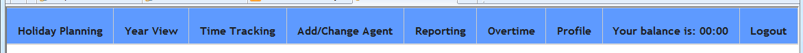
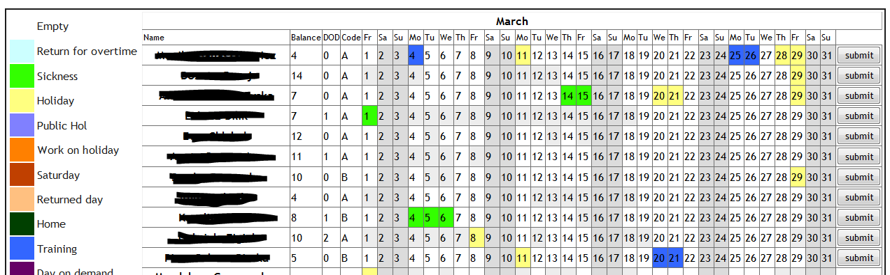
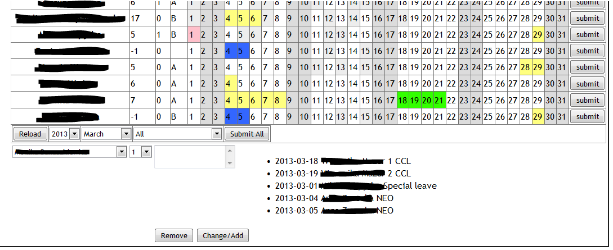
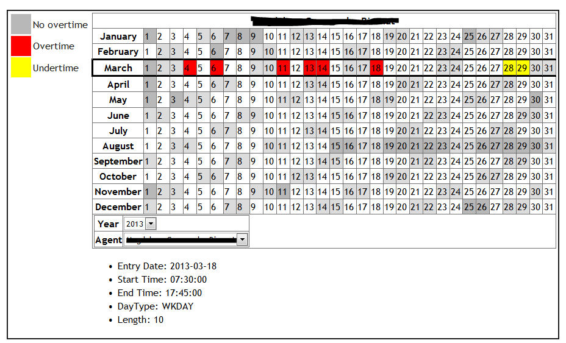
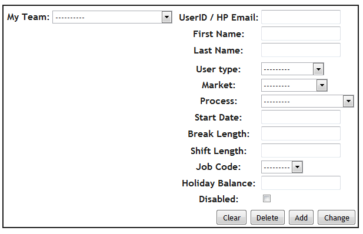
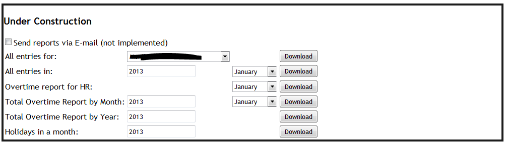
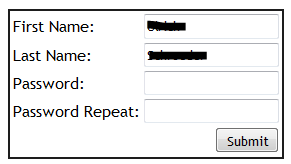

Instructions for managers using the timetracker
===============================================

Table of contents
-----------------

- `Features`_
- `Holiday Planning`_
- `Comments`_
- `Year View`_
- `Add/Change Agent`_
- `Reporting`_
- `Overtime`_
- `Your balance`_
- `Profile`_
- `Logout`_
- `Email functions`_

Features
--------

* One tool for holiday and time/overtime tracking.
* Web based – runs in all major browsers (IE, Chrome, Mozilla).
* Continuous tracking (multi-year).
* Holiday planning – overview of all reports at once or by team on one page.
* Access rights/visible functionality defined by user level assignment.
* Flexible shift/mandatory break setup per employee.
* Option to hide inactive employees (data is retained).
* Automatic work/overtime calculation (no need to login/track anything
  if regular shift day)
* Automated email notification when overtime is calculated to user and manager.
* Automated weekly email reminder about tracked times.
* Automated email notification when Sunday/Public Holiday/Saturday work is
  entered.
* Automated emailing of pre-filled overtime forms as PDF.
* Automated emailing of pre-filled Sunday/Public Holiday/Saturday forms PDF.
* Automated reporting of overtime to pay at month end.
* Ad-hoc reporting on holiday (monthly/yearly/by employee).
* Ad-hoc reporting on overtime (monthly/yearly).
* Automatic creation of overtime to pay sheet to be sent to HR at month end.
* Holiday/time tracking data used to feed to CATW (no additional manual CATW
  user entry required).
* Email reminder on forgotten password.
* Developed and supported in-house/direct contact to developer/quick change
  request procedure.
* More features to be added/requests welcome.

Link to the holiday/time tracker
--------------------------------

Here is the link to the timetracker: http://16.55.133.115:55/

Logging in
----------

Login with your HP email address and password.

Use the **forgot your password** feature if you cannot remember your password.

Navigation
----------

Below is the standard view of options on the top navigation bar for a manager
login (notice the counter on the far right – this is your current overtime
balance, if you were tracking time as well):

We will go through  the options one by one from left to right.

Holiday Planning
----------------

This is the main tab for holiday management for one or multiple
teams. Functionality is straight forward. Mark the day(s) with the mouse by
clicking on them and they will be highlighted.

Choose a category from the legend to the left and it will be applied to the
highlighted days. You must click submit for the changes to be written to the
database. There are submit buttons for one row at a time and at the bottom of
the list you can find a submit all button to submit all changes at once. If
you are not happy with your selection or category chosen you can either change
your selection day by day or just click the reload button at the bottom of the
list and all fields will be reset. Change of day(s) can be done by selecting
the days in question then choose a new category and submit. To delete a day,
select it and choose Empty from the category list, then submit. At the bottom
of the list are some additional dropdown lists/buttons where you can choose
year, month and team. If you have many reports on the main list and are using
slower browsers like Internet Explorer, it definitely helps to select a team
prior to entering changes and submitting them. The longer the displayed list
of employees, the longer the time to reload the page after submission. If you
see some light grey fields (lighter grey than the pre-marked weekends) this
indicates that for this day there was a manual time tracking entry done by the
by the employee – see :ref:`timetracking`

Comments
--------

Here you can also add comments to a date field. Note that the comment feature
only works if the date field has a category chosen and submitted
previously. You cannot add a comment to an empty field. To add a comment,
chose the name of the employee in the dropdown, then chose the date, enter the
comment and click the change/add button – the comment will appear with date
and name of the employee under the list. To change or delete a comment select
the name/date again and then change or delete by using the respective button.

Year View
---------

This option allows you to view one complete year for one employee at a
glance. All categories marked and submitted on the main holiday planning page
will appear on this overview. Below the overview you can chose the year and
the employee and you can also see some basic statistics regarding the chosen
employee.

This page is very useful for quick reconciliations (or for longer ones when it
comes to find a balance with GTT) This is a review only page. No changes can
be made here.

Add/Change Agent
----------------

This is the main administration part of the tracker. Here you set up each
employee with his/her specific details.  Note that all errors in initial
employee setup will be present everywhere in the tool and will also lead to
incorrect reporting. You can always update/change employee data here.  Fill in
all fields with the required information or chose from drop-down
lists. Depending on how your account is set up you might not use all
fields. Job Code for example is not used/wanted in all accounts and can be
used for other purposes like A/B schedule as well.  Note that if an employee
does not manually track his time on a regular work day, the tool will take the
hour values for this day from whatever is set up here in break length and
shift length.  Verify with the programmer, that what you set up here is in
sync with the current calculation rules for your account. The tool is flexible
but the rules have to be agreed on once to get the correct overall hours in
the end.

The tick box button can be used to hide an employee on the various screens in
the tool. The employee data will be retained in the background.  Since this is
a continuous, multi-year tracker, it is planned to implement 20/26 day holiday
allowance choice field, so that on year change or when the change occurs
during the year the new allowance value is automatically taken into account
and added to the balance.

Reporting
---------

In the reporting tab you can find a range of reports. This section is still
under construction but most of the reports you can see here are already
working. Reports are downloadable in CSV format and can easily be used in
Excel or other tools.

Overtime
--------

The overtime tab is similar to the year view for holidays. You can see one
whole year of overtime/undertime entries for one employee at once. This is a
very handy overview to check the HR overtime forms submitted by employees to
see if keyed overtime was correct and if the day to redeem this overtime was
keyed with reduced hours.

Your balance
------------

This is where you can find the current balance of all time entries made in the
tracker. The balance does not refresh on its own. If you made a time entry
that affects the balance, you need to either click on it directly or refresh
the page to see the new balance.

Profile
-------

Allows you to change your own password to access the holiday/time tracker.

Logout
------

Does what it says on the tin.

Email functions
---------------

There is no input required by the user for any of the email functionality. The
tracker will send automated confirmation emails for every tracking activity by
the user. In case of overtime, the user will get an email with a pre-filled
PDF document that only needs to be printed and signed and handed to the
manager. As a manager of that employee you will receive an email notification
with the details of the entry but no PDF form. Every change of an overtime
entry in the tracker will send a new PDF form to the user and a new email to
the manager.  The tracker also sends a weekly reminder of total time tracked
each Monday to each user. Even if a user did not track anything manually, he
will receive this confirmation on how many hours the tool tracked
automatically.  On the holiday tracker side, the tool will send automated and
pre-filled PDF forms to the employee if work on Saturday or Sunday is entered.
