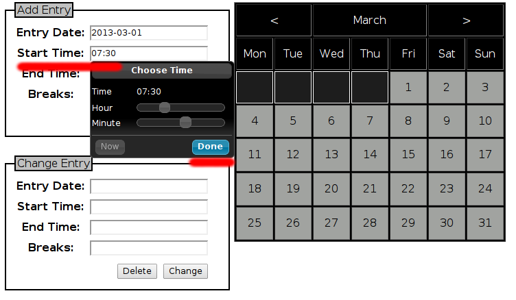

Instructions for daily time tracking
====================================

Table of contents
-----------------

- `Features`_
- `Link to the holiday/time tracker`_
- `Logging in`_
- `Tracking Navigation`_
- `Adding an Entry`_
- `Changing an Entry`_
- `Viewing your Calendar`_
- `Legend explanation`_
- `Communication functions`_
- `Developer Support`_

Features
--------

* One tool for holiday and time tracking
* Holiday planning – overview of your whole team on one page
* Automatic work/overtime calculation (no need to login/track anything if
  regular 8 hour day)
* Automated email notification when overtime is calculated to user and manager
* Automated weekly email reminder about tracked times
* Automated email notification when Sunday/Public Holiday/Saturday work is
  entered (WIP)
* Automated emailing of pre-filled overtime forms as PDF (WIP)
* Automated emailing of pre-filled Sunday/Public Holiday/Saturday forms PDF (WIP)
* Automated emailing of pre-filled “change requests” forms as PDF (WIP)
* Automated reporting of overtime to pay at month end
* Ad-hoc reporting on holiday
* Ad-hoc reporting on overtime
* Holiday/time tracking data used to feed to CATW (no additional manual CATW
  user entry required)
* Developed and supported in-house/direct contact to developer/quick change
  request procedure
* More features to be added (WIP - work in progress), as we continue using
  this tracker

Link to the holiday/time tracker
--------------------------------

Here is the link to the timetracker: http://bpotimetracker.pol.hp.com

Logging in
----------

Login with your HP email address and password.

Use the **forgot your password** feature if you cannot remember your password.

Tracking Navigation
-------------------

Click on **Time Tracking** in the blue top area (notice the counter on the far
right – this is your current overtime balance):

.. _timetracking:

Timetracking interface
----------------------

Below is the interface for which you will be using to track your time. There
is a breakdown of what each component is for below.

Adding an Entry
---------------

This is the time entry field for the current day. Each day you will log in
to the holiday/time tracker and set your daily work time in the **Add Entry**
field. This is done by using sliders for hours and minute:

- Choose the date by selecting the day on the large calendar to the right
  or click on the field for **Entry Date** and a small calendar will appear.
  Click on the date of the day you want to add an entry for.

- Next you set up your **Start Time** on that day. Slide the hour and minute
  sliders until they display your start time in 24 hour system. Example: you
  start at 07:30 in the morning you set your start time as:

- Next you set up your **End Time** for this day. Slide hours and minutes to
  display your end time in 24 hour system, just as you did for the start time.
  Sticking with the example above – assuming you are working a regular 8 hour
  day and you set the start time to 07:30 you should now set the end time to
  15:15 (you will key a 15 minute break later.)

- Next you have to set up your “Breaks”. Add up all time spent during the day
  on breaks and use the slider(s) to set the total break time.

- As a last step you must press the “Add” button. You will see the calendar
  to the right will disappear for a moment. Once it is back, the entry you
  just created is saved.

Hints
-----
- Note that your break should be set up as a minimum of 15 minutes.
- Breaks will automatically be deducted from your daily work time. Your break
  time will influence the reported total time worked during this day.
- In our example above you will report a regular 8 hour work day including a
  15 minute break. If you key a one hour break, you must adjust your
  **End time** entry to include the extra break time.
- Note that you do not have to log in and track time for a regular 8 hour day
  at all. If no time is tracked for a day and the holiday tracker has no
  additional information on that day, the tool assumes you were at work for
  8 hours. However, you have the option to change those auto-entries before
  month end.
- To add an entry you would always click the **Done** button. There is also
  a **Now** button that will automatically enter the time that is now.

Changing an entry
-----------------

There can be several scenarios why you would want to change an entry you
previously made. Here is hot to do it.

Go to the time tracking page, as if you wanted to make a new entry (explained
above). Now, click on the day you want to change on the large calendar to the
right. If you previously tracked something for that day, the data will
automatically appear in the **Change Entry** box.

Click into the field you want to change and the sliders for hours/minutes
appear to adjust. Once you are happy with the changes press the **Change**
button to save your data.

If you want to delete an entry for the day, first load the data by clicking
on the day on the calendar, then press the **Delete** button.

Viewing your Calendar
---------------------

The large calendar on this page gives you an overview of the current month.
You can change the month with the arrows on top. Days that were marked with
a category from the holiday planner will appear in the same color in this
calendar, as they do appear in the holiday planner. Days without any kind of
entry appear as dark grey fields. Days with work time entry appear as light
grey fields.

Legend Explanation
------------------

On the left of the page you can see a reference to the holiday planner,
acting as a legend for the different colors.

Communication functions
-----------------------

There is no input required by the user for any of the email functionality.
The tracker will send automated confirmation emails for every tracking activity
by the user.

In addition, the tracker will send an automated weekly email listing your
data entries in the week before.

Developer Support
-----------------

For any and all queries please get in touch with: Aaron France
(aaron.france@hp.com)
